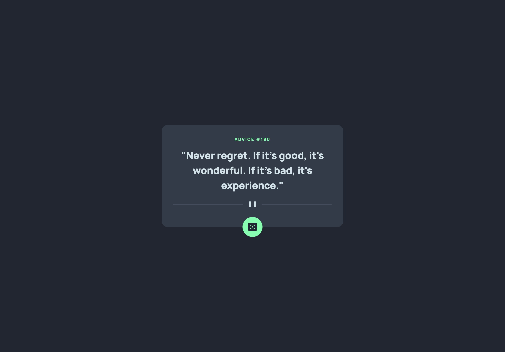

# Frontend Mentor - Advice generator app solution

This is a solution to the [Advice generator app challenge on Frontend Mentor](https://www.frontendmentor.io/challenges/advice-generator-app-QdUG-13db). Frontend Mentor challenges help you improve your coding skills by building realistic projects.

## Table of contents

- [Overview](#overview)
  - [The challenge](#the-challenge)
  - [Screenshot](#screenshot)
  - [Links](#links)
- [Built with](#built-with)
- [Author](#author)

## Overview

### The challenge

Users should be able to:

- View the optimal layout for the app depending on their device's screen size
- See hover states for all interactive elements on the page
- Generate a new piece of advice by clicking the dice icon

### Screenshot

### Links

- Live Site URL: [Advice Generator](https://challenges.liamsnowdon.uk/advice-generator)

## Built with

- Nuxt.js/Vue.js
- TypeScript for typing API response and component props
- UnoCSS for styling

## Author

- Website - [Liam Snowdon](https://liamsnowdon.uk)
- Frontend Mentor - [@liamsnowdon](https://www.frontendmentor.io/profile/liamsnowdon)
