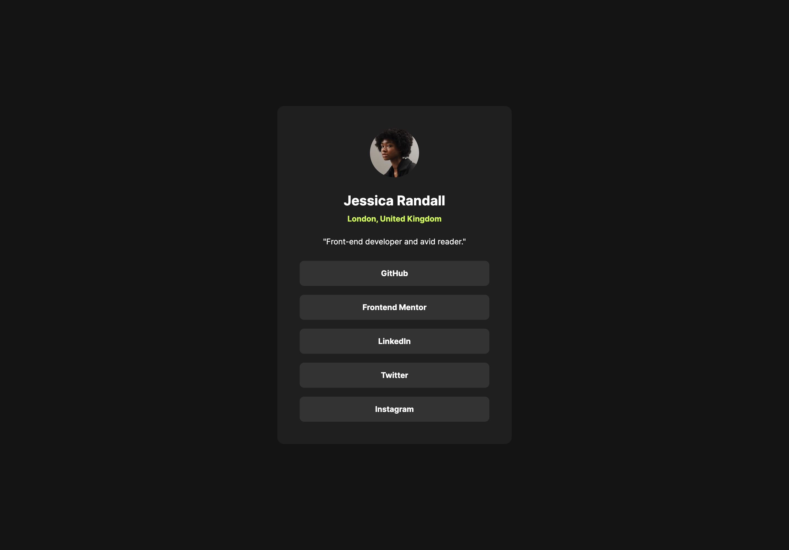

# Frontend Mentor - Social links profile solution

This is a solution to the [Social links profile challenge on Frontend Mentor](https://www.frontendmentor.io/challenges/social-links-profile-UG32l9m6dQ). Frontend Mentor challenges help you improve your coding skills by building realistic projects. 

## Table of contents

- [Overview](#overview)
  - [The challenge](#the-challenge)
  - [Screenshot](#screenshot)
  - [Links](#links)
- [Built with](#built-with)
- [Author](#author)

## Overview

### The challenge

Users should be able to:

- See hover and focus states for all interactive elements on the page

### Screenshot

### Links

- Live Site URL: [Social Links](https://ls-challenges-social-links.netlify.app)

## Built with

- HTML
- CSS 

## Author

- Website - [Liam Snowdon](https://liamsnowdon.uk)
- Frontend Mentor - [@liamsnowdon](https://www.frontendmentor.io/profile/liamsnowdon)
