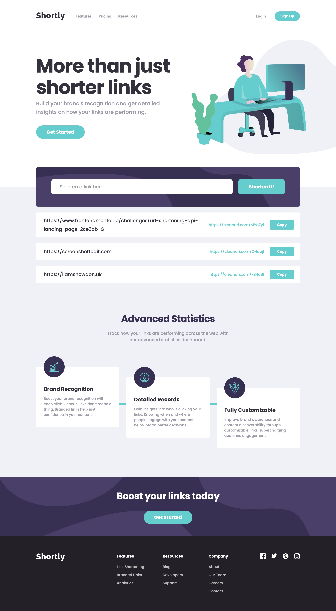
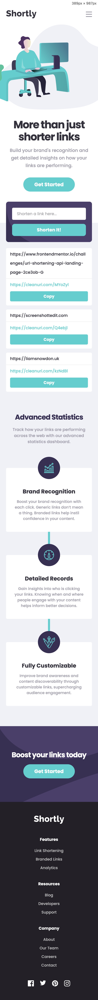

# Frontend Mentor - Shortly URL shortening API Challenge solution

This is a solution to the [Shortly URL shortening API Challenge challenge on Frontend Mentor](https://www.frontendmentor.io/challenges/url-shortening-api-landing-page-2ce3ob-G). Frontend Mentor challenges help you improve your coding skills by building realistic projects. 

## Table of contents

- [Overview](#overview)
  - [The challenge](#the-challenge)
  - [Screenshot](#screenshot)
  - [Links](#links)
- [Built with](#built-with)
- [Author](#author)
- [Running locally](#running-locally)

## Overview

### The challenge

Users should be able to:

- View the optimal layout for the site depending on their device's screen size
- Shorten any valid URL
- See a list of their shortened links, even after refreshing the browser
- Copy the shortened link to their clipboard in a single click
- Receive an error message when the `form` is submitted if:
  - The `input` field is empty

### Screenshot




### Links

- Live Site URL: [URL Shortener](https://ls-challenges-url-shortener.netlify.app) 

## Built with

- Nuxt.js/Vue.js
- TypeScript
- UnoCSS

## Author

- Website - [Liam Snowdon](https://liamsnowdon.uk)
- Frontend Mentor - [@liamsnowdon](https://www.frontendmentor.io/profile/liamsnowdon)

## Running locally

```bash
npm install
```

Start the development server on `http://localhost:3000`:

```bash
npm run dev
```
